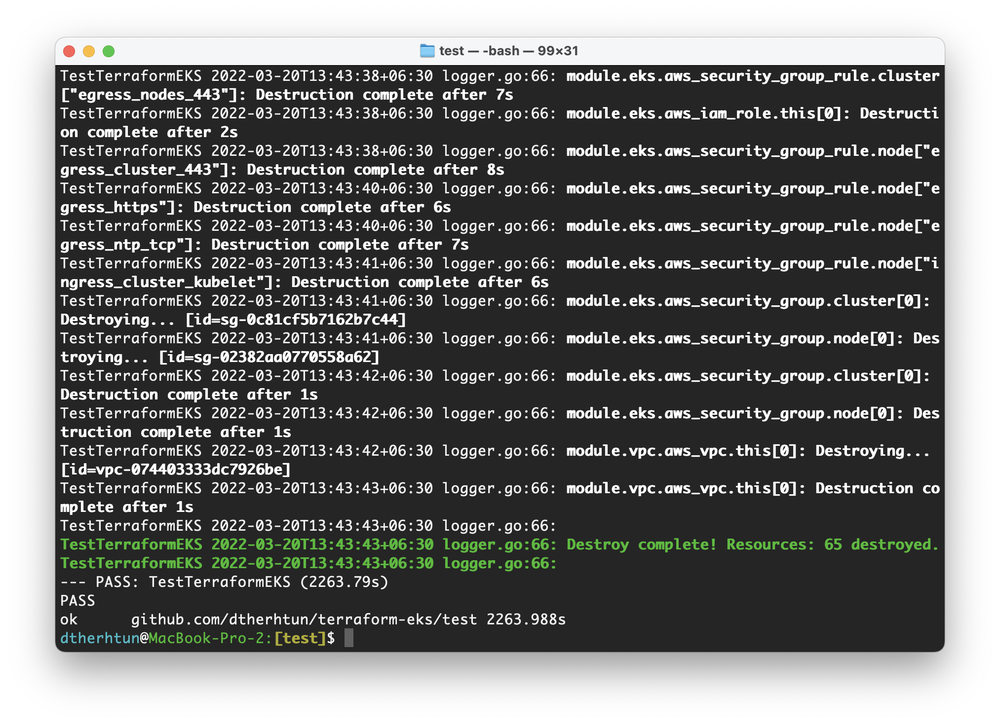

# EKS infra

## Run End to End Test
```
$ cd test/
$ go test -v -timeout 45m
```
### Test Result


<!-- BEGINNING OF PRE-COMMIT-TERRAFORM DOCS HOOK -->
## Requirements

| Name | Version |
|------|---------|
| <a name="requirement_terraform"></a> [terraform](#requirement\_terraform) | >= 1.1.6 |
| <a name="requirement_local"></a> [local](#requirement\_local) | ~> 2.1.0 |
| <a name="requirement_null"></a> [null](#requirement\_null) | ~> 3.1.0 |
| <a name="requirement_tls"></a> [tls](#requirement\_tls) | ~> 3.1.0 |

## Providers

| Name | Version |
|------|---------|
| <a name="provider_aws"></a> [aws](#provider\_aws) | 4.2.0 |
| <a name="provider_local"></a> [local](#provider\_local) | 2.1.0 |
| <a name="provider_null"></a> [null](#provider\_null) | 3.1.0 |

## Modules

| Name | Source | Version |
|------|--------|---------|
| <a name="module_eks"></a> [eks](#module\_eks) | terraform-aws-modules/eks/aws | 18.7.2 |
| <a name="module_vpc"></a> [vpc](#module\_vpc) | terraform-aws-modules/vpc/aws | 3.12.0 |

## Resources

| Name | Type |
|------|------|
| [aws_kms_key.eks](https://registry.terraform.io/providers/hashicorp/aws/latest/docs/resources/kms_key) | resource |
| [aws_security_group.additional](https://registry.terraform.io/providers/hashicorp/aws/latest/docs/resources/security_group) | resource |
| [local_file.kubeconfig](https://registry.terraform.io/providers/hashicorp/local/latest/docs/resources/file) | resource |
| [null_resource.apply](https://registry.terraform.io/providers/hashicorp/null/latest/docs/resources/resource) | resource |
| [aws_eks_cluster_auth.this](https://registry.terraform.io/providers/hashicorp/aws/latest/docs/data-sources/eks_cluster_auth) | data source |

## Inputs

| Name | Description | Type | Default | Required |
|------|-------------|------|---------|:--------:|
| <a name="input_vpc"></a> [vpc](#input\_vpc) | Group variables of aws vpc looks like this:<pre>vpc = {<br>    is_enable_vpngw      = false<br>    is_enable_natgw      = true<br>    is_single_natgw      = true<br>    is_one_natgw_per_az  = false<br>  }</pre> | <pre>object({<br>    is_enable_natgw     = bool<br>    is_enable_vpngw     = bool<br>    is_single_natgw     = bool<br>    is_one_natgw_per_az = bool<br>  })</pre> | <pre>{<br>  "is_enable_natgw": true,<br>  "is_enable_vpngw": false,<br>  "is_one_natgw_per_az": false,<br>  "is_single_natgw": true<br>}</pre> | no |

## Outputs

| Name | Description |
|------|-------------|
| <a name="output_aws_auth_configmap_yaml"></a> [aws\_auth\_configmap\_yaml](#output\_aws\_auth\_configmap\_yaml) | Formatted yaml output for base aws-auth configmap containing roles used in cluster node groups/fargate profiles |
| <a name="output_cloudwatch_log_group_arn"></a> [cloudwatch\_log\_group\_arn](#output\_cloudwatch\_log\_group\_arn) | Arn of cloudwatch log group created |
| <a name="output_cloudwatch_log_group_name"></a> [cloudwatch\_log\_group\_name](#output\_cloudwatch\_log\_group\_name) | Name of cloudwatch log group created |
| <a name="output_cluster_addons"></a> [cluster\_addons](#output\_cluster\_addons) | Map of attribute maps for all EKS cluster addons enabled |
| <a name="output_cluster_arn"></a> [cluster\_arn](#output\_cluster\_arn) | The Amazon Resource Name (ARN) of the cluster |
| <a name="output_cluster_certificate_authority_data"></a> [cluster\_certificate\_authority\_data](#output\_cluster\_certificate\_authority\_data) | Base64 encoded certificate data required to communicate with the cluster |
| <a name="output_cluster_endpoint"></a> [cluster\_endpoint](#output\_cluster\_endpoint) | Endpoint for your Kubernetes API server |
| <a name="output_cluster_iam_role_arn"></a> [cluster\_iam\_role\_arn](#output\_cluster\_iam\_role\_arn) | IAM role ARN of the EKS cluster |
| <a name="output_cluster_iam_role_name"></a> [cluster\_iam\_role\_name](#output\_cluster\_iam\_role\_name) | IAM role name of the EKS cluster |
| <a name="output_cluster_iam_role_unique_id"></a> [cluster\_iam\_role\_unique\_id](#output\_cluster\_iam\_role\_unique\_id) | Stable and unique string identifying the IAM role |
| <a name="output_cluster_id"></a> [cluster\_id](#output\_cluster\_id) | The name/id of the EKS cluster. Will block on cluster creation until the cluster is really ready |
| <a name="output_cluster_identity_providers"></a> [cluster\_identity\_providers](#output\_cluster\_identity\_providers) | Map of attribute maps for all EKS identity providers enabled |
| <a name="output_cluster_oidc_issuer_url"></a> [cluster\_oidc\_issuer\_url](#output\_cluster\_oidc\_issuer\_url) | The URL on the EKS cluster for the OpenID Connect identity provider |
| <a name="output_cluster_platform_version"></a> [cluster\_platform\_version](#output\_cluster\_platform\_version) | Platform version for the cluster |
| <a name="output_cluster_security_group_arn"></a> [cluster\_security\_group\_arn](#output\_cluster\_security\_group\_arn) | Amazon Resource Name (ARN) of the cluster security group |
| <a name="output_cluster_security_group_id"></a> [cluster\_security\_group\_id](#output\_cluster\_security\_group\_id) | Cluster security group that was created by Amazon EKS for the cluster. Managed node groups use this security group for control-plane-to-data-plane communication. Referred to as 'Cluster security group' in the EKS console |
| <a name="output_cluster_status"></a> [cluster\_status](#output\_cluster\_status) | Status of the EKS cluster. One of `CREATING`, `ACTIVE`, `DELETING`, `FAILED` |
| <a name="output_oidc_provider"></a> [oidc\_provider](#output\_oidc\_provider) | The OpenID Connect identity provider (issuer URL without leading `https://`) |
| <a name="output_oidc_provider_arn"></a> [oidc\_provider\_arn](#output\_oidc\_provider\_arn) | The ARN of the OIDC Provider if `enable_irsa = true` |
| <a name="output_private_subnets"></a> [private\_subnets](#output\_private\_subnets) | List of IDs of private subnets |
| <a name="output_public_subnets"></a> [public\_subnets](#output\_public\_subnets) | List of IDs of public subnets |
| <a name="output_self_managed_node_groups"></a> [self\_managed\_node\_groups](#output\_self\_managed\_node\_groups) | Map of attribute maps for all self managed node groups created |
<!-- END OF PRE-COMMIT-TERRAFORM DOCS HOOK -->
